<p align="center">
  
</p>

<p align="center">
  
</p>

<p align="center">
  
</p>

<br>

<p align="center">
  <a href="#"></a>
  <a href="#"></a>
  <a href="#"></a>
  <a href="#"></a>
  <a href="#"></a>
  <a href="#"></a>
</p>

<p align="center">
  
</p>

<br>

<p align="center">
  
</p>

<br>

<p align="center">
  <a href="https://skillicons.dev">
    
  </a>
</p>

<br>

---

## 🧠 System Architecture

```mermaid
flowchart TB
    subgraph Frontend["🌐 Next.js 16 Frontend"]
        direction TB
        LP["🏠 Landing Page<br/>Pricing · FAQ · Testimonials"]
        AUTH["🔐 Auth Pages<br/>Login · Register · Verify"]
        DASH["📊 Dashboard<br/>Metrics · Charts · KPIs"]
        CM["📢 Campaigns<br/>CRUD · Detail · Import"]
        AN["📈 Analytics<br/>Charts · Filters · Export"]
        CS["🎨 Creative Studio<br/>AI Copy · History"]
        CP["💬 AI Copilot<br/>Chat · Models"]
        AT["⚡ Automation<br/>Rules · Triggers"]
        RP["📑 Reports<br/>Generate · PDF"]
        INT["🔗 Integrations<br/>Platforms · Status"]
        ADM["🛡️ Admin Panel<br/>Users · Billing · Settings"]
    end

    subgraph API["⚙️ API Layer"]
        direction TB
        API_AUTH["🔑 Auth API<br/>JWT · bcrypt · Cookies"]
        API_CRM["📋 Campaign API<br/>CRUD · Search · Import"]
        API_AI["🤖 AI API<br/>OpenRouter · Ollama · LM Studio"]
        API_AN["📊 Analytics API"]
        API_RP["📑 Reports API<br/>jsPDF Generation"]
        API_AT["⚡ Automation API"]
        API_BL["💳 Billing API<br/>Plans · Transactions"]
        API_ADM["🛡️ Admin API<br/>Stats · Users · Updates"]
    end

    subgraph DB["🗄️ Data Layer"]
        direction TB
        DB_PRISMA["Prisma 7 ORM"]
        DB_SQLITE["SQLite Database"]
        DB_MOCK["📦 Mock Data Layer<br/>8 Campaigns · Users · Charts"]
    end

    Frontend --> API
    API --> DB
    DB --> DB_PRISMA --> DB_SQLITE
    DB_PRISMA -.-> DB_MOCK
    API_AI --> AI_PROVIDERS

    subgraph AI_PROVIDERS["🧠 AI Providers"]
        OR["OpenRouter<br/>GPT-4o-mini"]
        OL["Ollama<br/>Local"]
        LMS["LM Studio<br/>Local"]
    end

    style Frontend fill:#1a1a2e,stroke:#7C3AED,stroke-width:2px
    style API fill:#16213e,stroke:#00F5FF,stroke-width:2px
    style DB fill:#0f3460,stroke:#FF00E5,stroke-width:2px
    style AI_PROVIDERS fill:#1a1a2e,stroke:#7C3AED,stroke-width:1px
```

```mermaid
flowchart LR
    subgraph AUTH["🔐 Auth Flow"]
        REG["Register"] --> VERIFY["Verify Email"]
        LOGIN["Login"] --> JWT["JWT Token<br/>httpOnly Cookie"]
        JWT --> API_ACCESS["API Access"]
    end

    subgraph DATA["📊 Data Flow"]
        UI["User Input"] --> MOCK["Mock Service"]
        MOCK --> RESP["Response"]
        MOCK -.-> DB_FUTURE["Prisma DB<br/>(Coming Soon)"]
    end

    subgraph PAYMENT["💳 Billing Flow"]
        PLAN["Select Plan"] --> TIER["Pricing Tier"]
        TIER --> CHECKOUT["Checkout"]
        CHECKOUT --> PAYMENT_GW["Payment Gateway<br/>(Stub)"]
        PAYMENT_GW --> SUCCESS["Success"]
    end

    style AUTH fill:#1a1a2e,stroke:#00F5FF
    style DATA fill:#1a1a2e,stroke:#7C3AED
    style PAYMENT fill:#1a1a2e,stroke:#FF00E5
```





<br>

---

## ✨ Features — What's Built

### 🔐 Authentication & Security
| Module | Details |
|:-------|:--------|
| **JWT Auth** | bcrypt password hashing, httpOnly cookie sessions |
| **Email Verification** | Nodemailer-based verification flow |
| **Role Management** | User / Admin roles with route guards |
| **Session Management** | Auth context provider, protected API middleware |

---

### 📊 Dashboard & Analytics
| Module | Details |
|:-------|:--------|
| **📈 Main Dashboard** | 8 KPI cards (Spend, Revenue, ROAS, CPA, CTR, Conversions, Active Campaigns, Budget), area chart (7-day trends), bar chart (campaign comparison), top campaigns table |
| **🔍 Campaign List** | Search, platform/status badges, CRUD with plan limit enforcement |
| **📋 Campaign Detail** | Per-campaign metrics, area chart, info table |
| **📊 Analytics Page** | Metric cards, area chart, pie chart (platform breakdown), bar chart (daily performance) |

---

### 🧠 AI Capabilities
| Module | Details |
|:-------|:--------|
| **🤖 AI Copilot** | Chat interface with conversation history, model selector (GPT-4, GPT-3.5, Claude 3), suggested prompts, markdown rendering |
| **🎨 Creative Studio** | AI ad copy generator for Google / Meta / TikTok / Taboola — 6 creative types (headline, text, description, CTA, email, landing page) with history |
| **📑 CSV Analysis** | Upload CSV → column mapping → AI generates executive summary, wasted spend analysis, opportunities, budget recommendations |
| **🔌 Provider System** | Pluggable: OpenRouter (default), Ollama (local), LM Studio (local), Custom |

---

### ⚡ Automation & Reports
| Module | Details |
|:-------|:--------|
| **⚙️ Automation Rules** | 5 trigger types (ROAS threshold, budget exceeded, CPA spike, CTR drop, schedule) × 5 action types (notify, pause campaign, adjust budget, generate report, send email) |
| **📑 Report Generator** | 4 templates (Weekly, Monthly, Campaign Summary, Performance Breakdown), PDF download via jsPDF, status tracking |
| **🔔 Smart Notifications** | Filterable (Success, Warning, Error, Recommendations), mark-as-read |

---

### 💼 Business & Admin
| Module | Details |
|:-------|:--------|
| **🏪 Landing Page** | Hero, feature highlights, testimonial carousel, FAQ accordion, footer |
| **💳 Pricing** | 5 tiers: Free, Starter ($9), Professional ($29), Business ($79), Enterprise ($199) |
| **🛒 Checkout** | Multi-step: country → currency → payment method → processing → success |
| **🛡️ Admin Panel** | Dashboard (user count, revenue, subs), User management, Settings, Changelog, Billing (MRR, ARR, Churn, ARPU, LTV, transactions, subscriptions, coupons) |
| **⚙️ Settings** | Profile, Workspace, Password, Notifications, Danger Zone tabs |

---

### 🔗 Integrations
| Platform | Status |
|:---------|:-------|
| Google Ads | 🔌 Connection UI + card |
| Meta Ads | 🔌 Connection UI + card |
| TikTok Ads | 🔌 Connection UI + card |
| Taboola | 🔌 Connection UI + card |
| HubSpot | 🔌 Connection UI + card |
| Salesforce | 🔌 Connection UI + card |
| Shopify | 🔌 Connection UI + card |
| Slack | 🔌 Connection UI + card |

---

### 🧩 Additional Features
| Feature | Description |
|:--------|:------------|
| **🌐 Global Search** | Cmd+K modal searching campaigns, reports, messages |
| **🎯 Onboarding Tour** | Multi-step interactive tour covering all dashboard features |
| **📱 Responsive Sidebar** | Collapsible navigation with admin link |
| **🗄️ Database Schema** | 19 Prisma models: User, Workspace, Campaign, Creative, Insight, Recommendation, Conversation, Message, Automation, Report, Integration, Notification, Settings, AuditLog, SiteSettings, UpdateLog, BillingPlan, Subscription, Transaction, Invoice, Refund, Coupon |
| **📦 Mock Data** | 8 campaigns across Google / Meta / TikTok / Taboola, mock automations, analytics, conversations, recommendations |

<br>

---

## 🌐 System Status

<p align="center">
  
</p>

<p align="center">

| MODULE | STATUS | UPTIME | LOAD |
|:-------|:------:|:------:|:----:|
| 🟢 **AI Core** | `ONLINE` | 99.99% | 12% |
| 🟣 **Analytics Engine** | `ACTIVE` | 99.97% | 34% |
| 🔵 **Campaign Controller** | `RUNNING` | 99.95% | 28% |
| 🟢 **Automation Nexus** | `ENABLED` | 99.99% | 8% |
| 🔷 **Database Cluster** | `CONNECTED` | 99.99% | 22% |
| ⚡ **Intelligence Feed** | `REAL-TIME` | 99.98% | 16% |

</p>

<p align="center">
  
</p>

<br>

---

## 🛠 Tech Stack

<p align="center">
  <a href="https://skillicons.dev">
    
  </a>
</p>

<p align="center">
  <sub><i>hover over icons for a closer look ✦ premium stack for premium results</i></sub>
</p>

<br>

| Category | Technologies |
|:---------|:-------------|
| **Framework** | Next.js 16, React 19, TypeScript 5 |
| **Styling** | Tailwind CSS 4, Framer Motion, CVA, Lucide Icons |
| **Database** | Prisma 7, SQLite, Better-SQLite3 |
| **Auth** | JWT (bcryptjs + httpOnly cookies), Nodemailer |
| **Charts** | Recharts, date-fns |
| **State** | Zustand (persisted), TanStack React Query 5 |
| **AI** | OpenRouter (GPT-4o-mini), Ollama, LM Studio |
| **PDF** | jsPDF |
| **Validation** | Zod 4 |
| **Deployment** | Vercel |

<br>

---

## 🚀 Getting Started

### Prerequisites

- Node.js 18+
- npm 9+

### Installation

```bash
# Clone the repository
git clone https://github.com/ayushnandi718-dev/adpilot-ai.git
cd adpilot-ai

# Install dependencies
npm install

# Set up environment variables
cp .env.example .env
# Fill in your JWT secret and email credentials

# Initialize the database
npx prisma generate
npx prisma db push

# Seed admin user (optional)
npm run create-admin

# Start the development server
npm run dev
```

Open **[http://localhost:3000](http://localhost:3000)** — your command center awaits.

<br>

---

## 🔐 Environment Variables

| Variable | Description | Required |
|:---------|:------------|:--------:|
| `DATABASE_URL` | Database connection string | ✅ |
| `JWT_SECRET` | JWT signing secret | ✅ |
| `SMTP_HOST` | Email server host | ◻️ |
| `SMTP_PORT` | Email server port | ◻️ |
| `SMTP_USER` | Email server user | ◻️ |
| `SMTP_PASS` | Email server password | ◻️ |
| `OPENROUTER_API_KEY` | OpenRouter API key | ◻️ |
| `DEFAULT_AI_PROVIDER` | Default AI provider | ◻️ |
| `ADMIN_EMAIL` | Predefined admin login email | ◻️ |
| `ADMIN_PASSWORD` | Predefined admin login password | ◻️ |

<br>

---

## 📦 Deployment

<table>
<tr>
<td width="50%" valign="top">

### ▲ Vercel
1. Push to GitHub
2. Import project in Vercel
3. Add environment variables
4. Deploy ✨

</td>
<td width="50%" valign="top">

### ⚙️ Manual
```bash
npm run build
npm start
```

</td>
</tr>
</table>

<br>

---

## 📁 Project Structure

```
src/
├── app/              # Next.js App Router pages & API routes
│   ├── api/         # 30+ REST API endpoints
│   ├── auth/        # Login, Register, Verify pages
│   ├── dashboard/   # Dashboard, Campaigns, Analytics, etc.
│   └── layout.tsx   # Root layout with providers
├── components/       # Reusable UI components
│   ├── ui/          # Base primitives (button, card, modal, etc.)
│   ├── layout/      # Sidebar, Header, Shell
│   └── shared/      # Cross-feature shared components
├── features/        # Feature-specific components & logic
├── hooks/           # Custom React hooks
├── services/        # Business logic (campaign, AI, etc.)
├── repositories/    # Data access layer (Prisma + mock fallback)
├── store/           # Zustand stores (campaign-store)
├── providers/       # React context providers (Auth, Query)
├── lib/             # Utilities, constants, types
├── mock/            # Development mock data
└── generated/       # Prisma client output
```

<br>

---

## 🗺️ API Routes

| Category | Endpoints |
|:---------|:----------|
| **🔑 Auth** | `POST login`, `POST register`, `POST logout`, `GET me`, `GET verify-email`, `POST send-verification` |
| **📢 Campaigns** | `GET all`, `GET/:id`, `DELETE/:id`, `GET search`, `POST import`, `POST analyze` |
| **🤖 AI** | `POST /api/ai` (completions), `POST /api/copilot` (chat) |
| **📊 Analytics** | `GET /api/analytics` |
| **📈 Dashboard** | `GET /api/dashboard` |
| **⚡ Automations** | `GET`, `POST /api/automations` |
| **📑 Reports** | `GET`, `POST /api/reports` |
| **💡 Recommendations** | `GET /api/recommendations` |
| **🔔 Notifications** | `GET /api/notifications` |
| **⚙️ Settings** | `GET`, `PUT /api/settings` |
| **🔍 Search** | `GET /api/search` |
| **💳 Billing** | `POST /api/billing/create-payment` |
| **🛡️ Admin** | `GET stats`, Users CRUD, Settings CRUD, Updates CRUD, Billing management |

<br>

---

<p align="center">
  
</p>

<br>

<p align="center">
  <a href="https://github.com/ayushnandi718-dev">
    
    
  </a>
</p>

<p align="center">
  
</p>

<br>

<p align="center">
  
</p>

<br>

<p align="center">
  
</p>

---

## 🤝 Open for Contributions

<p align="center">
  
  
  
</p>

We're actively looking for contributors! Here's how you can help:

### 🚀 Ways to Contribute

| Area | Ideas |
|:-----|:------|
| **🧠 AI Features** | More ad copy generators, A/B test predictions, sentiment analysis |
| **🔌 Integrations** | Real Google/Meta/TikTok API connectors (instead of stubs) |
| **💳 Payments** | Wire up Stripe, PayPal, Razorpay webhooks |
| **📊 Analytics** | Export to CSV/PDF, custom date ranges, real-time dashboards |
| **⚡ Automation** | Background job runner, Slack/email notifications |
| **🎨 UI/UX** | Dark mode variants, mobile polish, animations |
| **🐛 Bug Fixes** | Check the [Issues](../../issues) tab |
| **📖 Docs** | Improve API docs, add usage examples |

### 📋 Getting Started

```bash
# Fork & clone
git clone https://github.com/your-username/adpilot-ai.git
cd adpilot-ai

# Install
npm install

# Create branch
git checkout -b feature/your-feature-name

# Make changes & commit
git commit -m "feat: add your feature description"

# Push & open a PR
git push origin feature/your-feature-name
```

### ✅ Guidelines

- Keep PRs focused — one feature/fix per PR
- Follow existing code style (TypeScript, Tailwind, no comments)
- Test your changes with `npm run lint` and `npx tsc --noEmit`
- Update the README if your change affects usage
- Be kind and constructive in code reviews

<p align="center">
  <sub>All skill levels welcome. If you're new to open source, we're here to help you through your first PR! 🚀</sub>
</p>

---

## 🏷️ Tags

<p align="center">

`ai-marketing` `nextjs` `react` `typescript` `prisma` `sqlite` `tailwind-css` `jwt-auth` `saas` `marketing-intelligence` `ad-copy-generator` `campaign-management` `analytics-dashboard` `openrouter` `framer-motion` `zustand` `react-query` `recharts`

</p>

<p align="center">
  <sub>Click the <b>🏷️ Topics</b> button at the top of the repo to add these tags on GitHub.</sub>
</p>

<br>

<p align="center">
  
</p>

<p align="center">
  
</p>

<br>

<p align="center">

━━━━━━━━━━━━━━━━━━━━━━━━━━━━━━━━━━━━━━━━━━━━━━

⚡ **SYSTEM ONLINE** • 🧠 **AI CORE ACTIVE** • 🌐 **NEURAL LINK ESTABLISHED** ⚡

━━━━━━━━━━━━━━━━━━━━━━━━━━━━━━━━━━━━━━━━━━━━━━

</p>

<p align="center">
  <sub><i>crafted with 🩷 — where data meets design</i></sub>
</p>

<p align="center">
  <sub>made by <strong>AYUSH NANDI</strong> — <a href="mailto:ayushnandi718@gmail.com">ayushnandi718@gmail.com</a></sub>
</p>

<p align="center">
  
</p>
